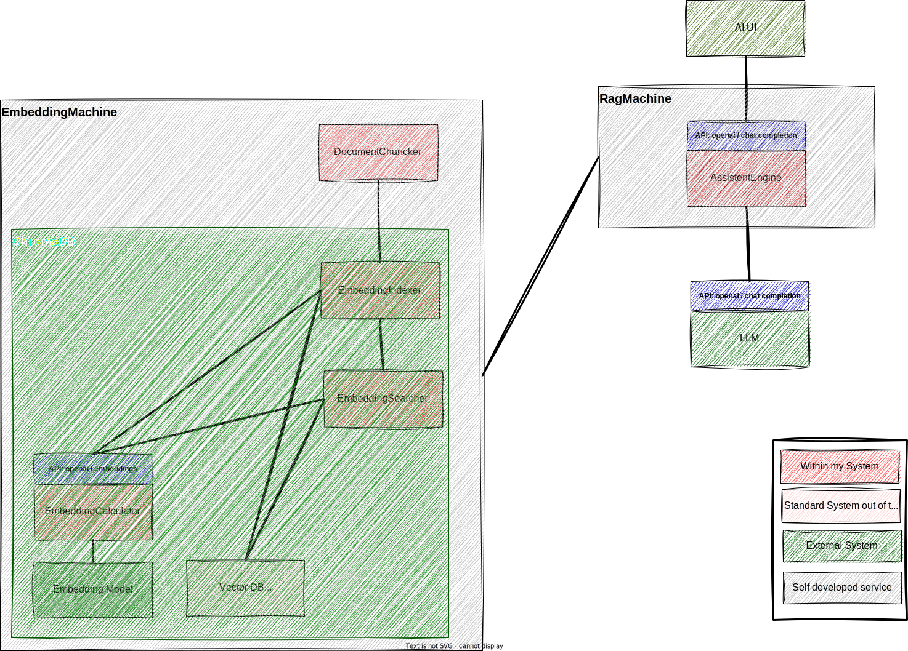

# RAGmachine

## Get things running

* Install stuff: `pip install -r requirements`
* Run tests: `python -m unittest discover tests`
* Ingest data: `python -m rag_machine.ingest`
* Start chat server: `python -m rag_machine`

## EmbeddingMachine and ChunkMachine

The EmbeddingMachine and the ChunkMachine are 2 classes that encapsulate the logic of how to chunk and embed data. Their main functionalities are as follows:

ChunkMachine
* Chunks documents into chunks
* Chunks will inherit their metadata from the parent document
* Chunks will get their own ID (a UUID) and will reference the document they come from by `Document.metadata["original_document_id"]`

EmbeddingMachine:
* Store documents and chunks
* Documents are stored in a TinyDB database
* When storing a document it gets an ID (a int) set in the `Document.metadata["id"]` field
* Chunks are stored in a ChromaDB database
* Chunks are expected to have an ID already. They get it in the chunking process (see ChunkMachine).
* Retrieve chunks by embedding distance.
* Retrieve documents by embedding distance to chunks of that document.

### Duplicate IDs
When adding a document that has an ID that already exists, it overwrides the existing document and the existing chunks.

Note: Technically all documents and chunks that are passed around ar LangChain Documets (`langchain.docstore.document.Document`). 

## Tech thoughts & reading

* [Chunking strategies from pinecone using LangChain](https://www.pinecone.io/learn/chunking-strategies/)
* ChromaDB:
  * [Usage guide](https://docs.trychroma.com/usage-guide)
* [Interface in Python - Real Python](https://realpython.com/python-interface/)
* [Building an entire RAG system with ChromaDB, Ollama and LangChain](https://github.com/rubentak/Mistral7B/blob/main/ChromaDB.ipynb) and [the Medium article](https://medium.com/@rubentak/talk-to-your-files-in-a-local-rag-application-using-mistral-7b-langchain-and-chroma-db-no-2b4ba77358e0)
* [Using LangChain with Ollama in Python - from Ollama tutorials](https://github.com/ollama/ollama/blob/main/docs/tutorials/langchainpy.md) (this uses the Odyssey by Homer as test data 😉).

## Todo

* Wrap writing ops in try/except
* Talk top it via whisper & bark
* Make sure LLM runs locally with MLX
* Rename project to bastelGPT
* Use [Open WebUI](https://github.com/open-webui/open-webui) as frontend

## Further things to check out

* Checkout the shortest AI Rag system I could find [here](https://ai.gopubby.com/improving-llms-with-ollama-and-rag-508fad3f841f)
* [ollama-voice-mac Local Voice Assistant with Mistral (via Ollama) & Whisper](https://medium.com/@ingridwickstevens/ollama-voice-mac-local-voice-assistant-with-mistral-via-ollama-whisper-d9827a749e61)

## Logbook

* 2024-03-13 Started the rewrite
* 2024-03-21 Moved to using langchain documents

